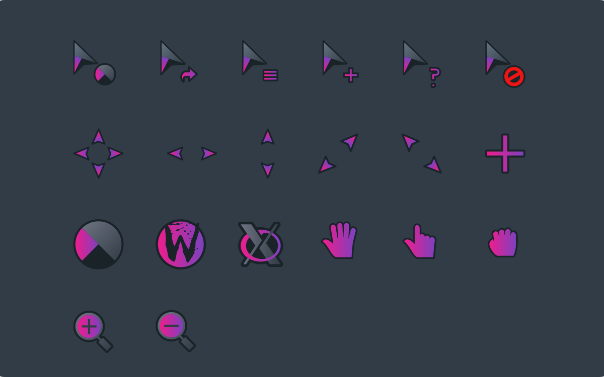
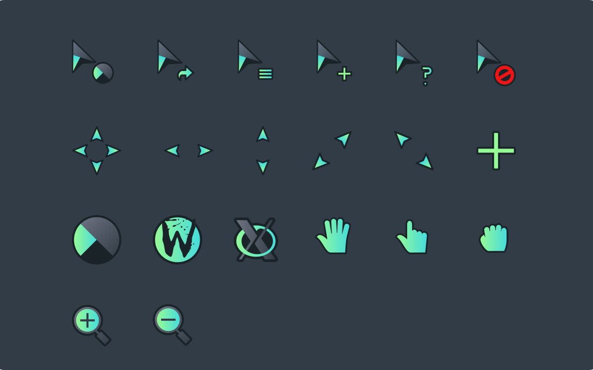
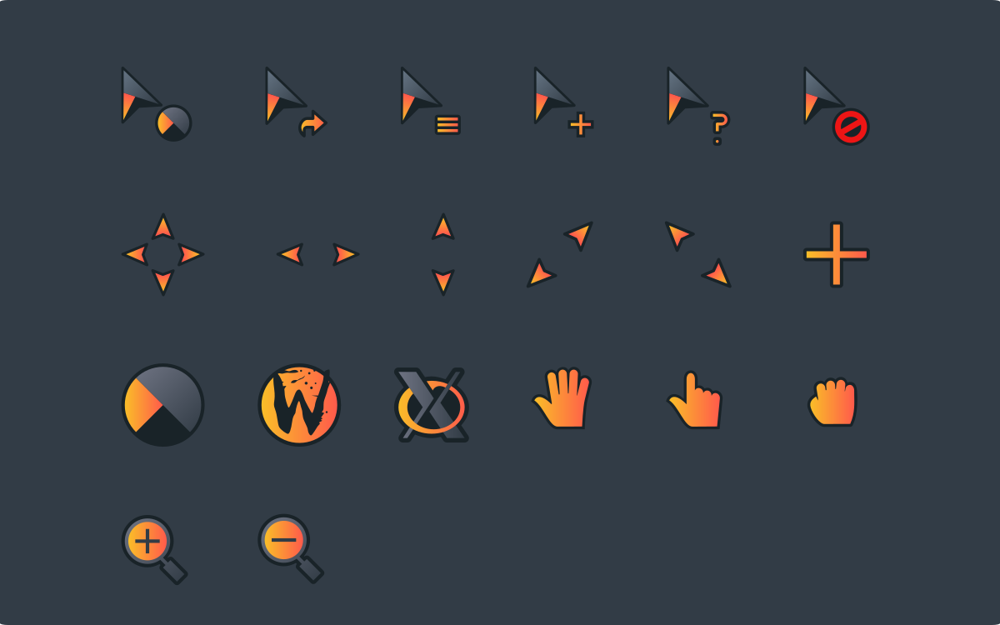
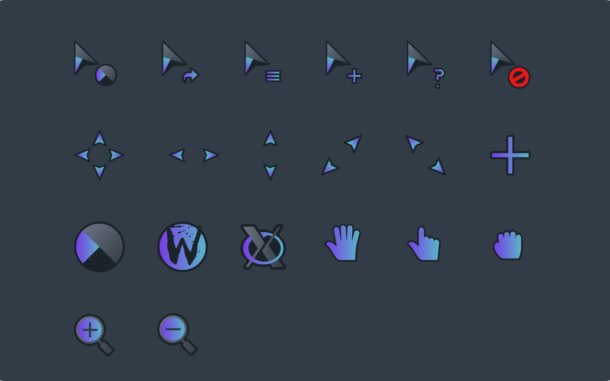
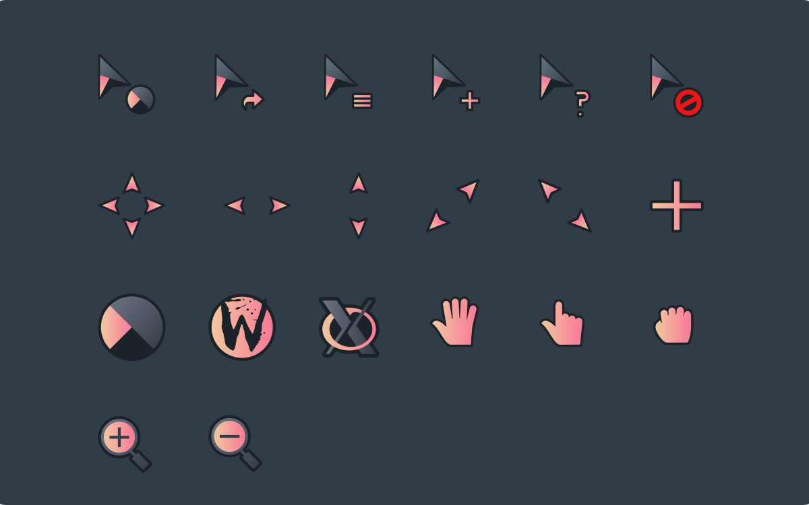
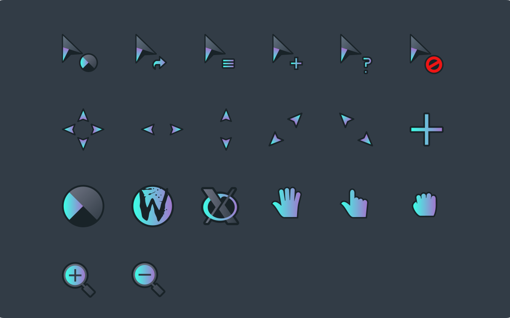
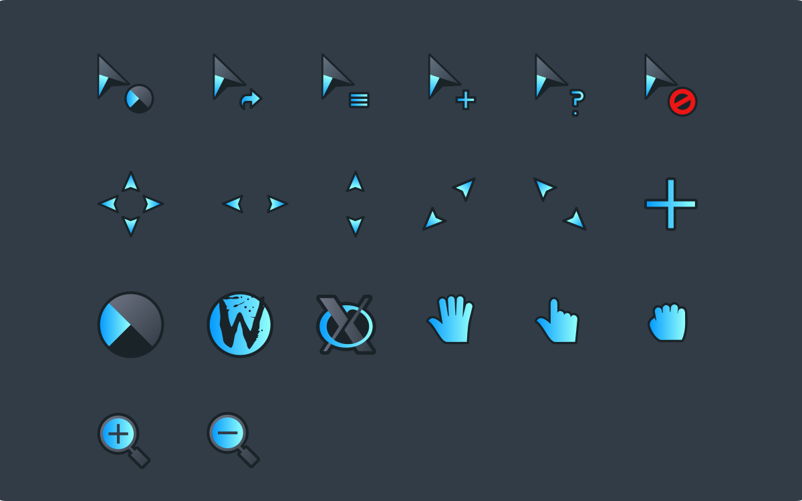
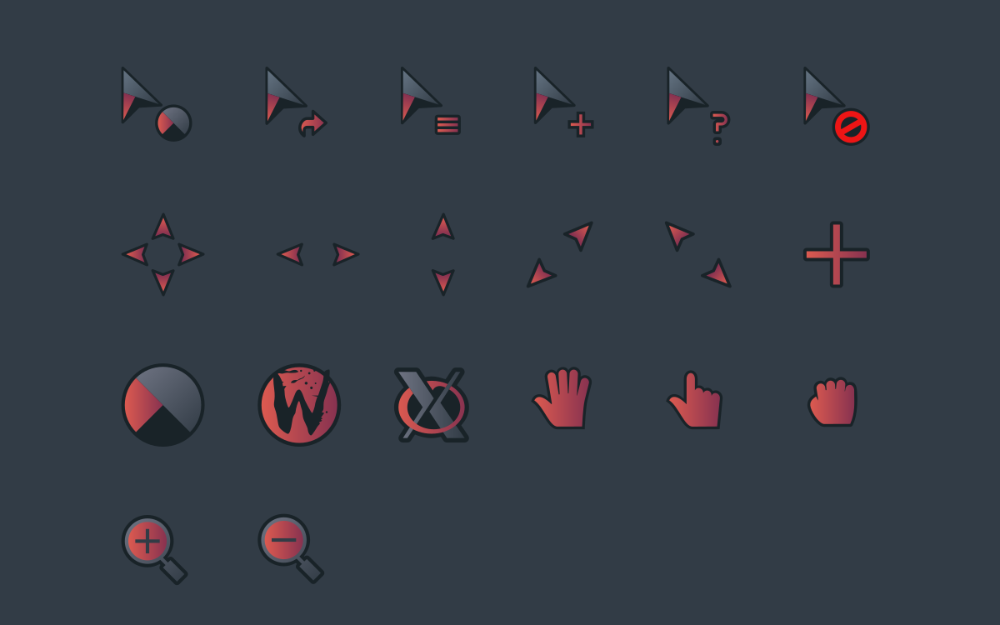

# Lyra cursors
This is an x-cursor theme inspired by macOS and
based on [capitaine-cursors](https://github.com/keeferrourke/capitaine-cursors).

Built versions of these cursor themes can be found on 
[yeyushengfan258's page on Gnome-Look.org](https://www.gnome-look.org/u/yeyushengfan258).

## Installation
To install the cursor theme simply copy the compiled theme to your icons
directory. For local user installation:

```
./install.sh [Theme name]
```

For system-wide installation for all users:

```
sudo ./install.sh [Theme name]
```

Then set the theme with your preferred desktop tools.

For available themes, see below.

## Arch

For Arch users, the `makepkg` command can be used with the included PKGBUILD file
to build and install all cursor themes.

```
makepkg -si
```

## Building from source
To build the cursors from source, you will need the following packages installed:

```
inkscape
xcursorgen (package name: xorg-xcursorgen)
```

You'll find everything you need to build and modify this cursor set in
the `src/` directory. To build the xcursor theme from the SVG source
run:

```
./build.sh [Theme name]
```

This will generate the pixmaps and appropriate aliases.
The freshly compiled cursor theme will be located in `dist/`

## Preview

### Theme name: LyraR


### Theme name: LyraX


### Theme name: LyraG


### Theme name: LyraP


### Theme name: LyraF


### Theme name: LyraQ
Note: the preview is slightly outdated, so the actual theme will be teal/pink


### Theme name: LyraB


### Theme name: LyraS


### Theme name: LyraY
There is also this yellow-green theme available
